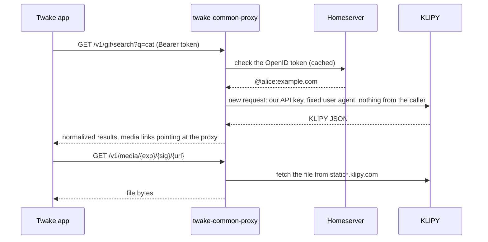

# twake-common-proxy

Twake apps call this service instead of third-party APIs, so a provider such as KLIPY never sees a user's IP address, user agent, cookies or identity. The provider only sees the proxy, its API key and the search terms.

The first module is GIF search, backed by [KLIPY](https://docs.klipy.com). More modules (web search, ...) plug in the same way.

## How a request flows



What the proxy guarantees:

- Each upstream request is built from scratch. Caller headers, cookies and addresses are never copied.
- No user identifier is sent to the provider.
- Logs and metrics record the route, status and duration. They never record the query, the caller or their address.
- Media links are signed and expire. The proxy only fetches media from the provider's own hosts and only relays images and videos.

## API

All `/v1` routes except media need `Authorization: Bearer <token>`. Errors use `application/problem+json`.

- `GET /v1/modules`: the modules that are on, their provider and the attribution the UI must show.
- `GET /v1/gif/search?q=&limit=&cursor=&locale=`: GIFs for a query.
- `GET /v1/gif/trending?limit=&cursor=&locale=`: trending GIFs.
- `GET /v1/gif/categories?locale=`: categories, each with the query to run.
- `GET /v1/gif/autocomplete?q=&limit=`: completions for a partial query.
- `GET /v1/media/{exp}/{sig}/{url}`: a GIF file. The link comes from a GIF result and works without a token until it expires. Byte ranges are supported.
- `GET /healthz`, `GET /readyz`, `GET /metrics`: probes and Prometheus metrics.

`limit` goes from 1 to 50. `cursor` is the `next` value of the previous page. `locale` looks like `fr` or `fr-FR`.

A GIF result looks like this:

```json
{
  "provider": "klipy",
  "attribution": {
    "name": "KLIPY",
    "url": "https://klipy.com",
    "searchPlaceholder": "Search KLIPY"
  },
  "next": "2",
  "results": [
    {
      "id": "hello-hi-662",
      "title": "Hello",
      "blurPreview": "data:image/jpeg;base64,...",
      "media": [
        {
          "size": "sm",
          "format": "webp",
          "mime": "image/webp",
          "url": "https://proxy.example.com/v1/media/...",
          "width": 220,
          "height": 220,
          "bytes": 80118
        }
      ]
    }
  ]
}
```

`size` is one of `xs`, `sm`, `md`, `hd`, and `format` one of `gif`, `webp`, `jpg`, `mp4`, `webm`. Clients pick the size and format they need. The search field must show the `searchPlaceholder` text, which KLIPY requires.

## Authentication

- Matrix clients send an OpenID token from `POST /_matrix/client/v3/user/{userId}/openid/request_token`, never their access token. The proxy checks it with the homeserver's `/_matrix/federation/v1/openid/userinfo` and accepts only users of that homeserver. When several homeservers are configured, the client names its own in `X-Matrix-Server-Name`.
- Backends such as cozy-stack send a static service token from the config.
- Each caller has its own rate limit.

## Configuration

The service reads a YAML file (`CONFIG_FILE`, default `config.yaml`). Any value can reference the environment as `${NAME}` or `${NAME:-default}`, which is how secrets get in. [config.example.yaml](config.example.yaml) lists every setting.

Web apps that call the proxy from the browser need their origin in `cors.origins`. Behind a reverse proxy, list it in `server.trustProxy`, or every client shares one rate limit.

To switch a module off, set `enabled: false`. To pick its provider, set `provider` and give that provider an entry under `providers`, with its API key. Set `proxyMedia: false` to hand clients the provider's own media URLs instead, which exposes user IPs to the provider.

## Adding a provider or a module

- A provider is one file under `src/modules/<module>/providers/`. It exports a config schema and a factory that implements the module's provider interface (`src/modules/gif/types.ts` for GIFs), mapping the provider's JSON to the shared result type. Register it in the module's config schema and in its `create...Provider` switch.
- A module is a folder under `src/modules/` with a provider interface, a result type and a Fastify plugin for its routes. `src/server.ts` mounts it at `/v1/<module>` when its config says `enabled: true`.
- Outbound calls go through `src/upstream.ts`, which builds every request from scratch.

## Development

```sh
npm ci
cp config.example.yaml config.yaml
npm run dev
npm run check   # typecheck, lint, format, tests
```

## KLIPY terms

KLIPY's [integration requirements](https://docs.klipy.com/integration-requirements) ask for written approval before routing API calls or media through a partner server. This service does both, so production use needs that approval.
