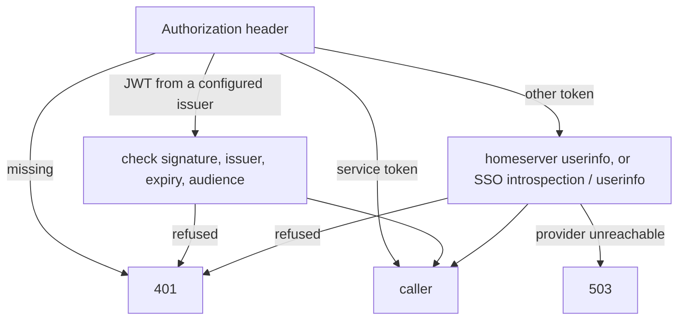

# HTTP API

All `/v1` routes except media need `Authorization: Bearer <token>`. Errors use `application/problem+json`.

## Routes

- `GET /v1/modules`: the modules that are on, their provider and the attribution the UI must show.
- `GET /v1/gif/search?q=&limit=&cursor=&locale=`: GIFs for a query.
- `GET /v1/gif/trending?limit=&cursor=&locale=`: trending GIFs.
- `GET /v1/gif/categories?locale=`: categories, each with the query to run.
- `GET /v1/gif/autocomplete?q=&limit=`: completions for a partial query.
- `GET /v1/media/{exp}/{sig}/{url}`: a GIF file. The link comes from a GIF result and works without a token until it expires. Byte ranges are supported.
- `GET /healthz`, `GET /readyz`, `GET /metrics`: probes and Prometheus metrics.

`limit` goes from 1 to 50. `cursor` is the `next` value of the previous page. `locale` looks like `fr` or `fr-FR`.

## Authentication

Any Twake app can call the proxy. The token decides how the caller is checked.

- A backend sends its own static service token, listed in the config.
- A Matrix client sends an OpenID token from `POST /_matrix/client/v3/user/{userId}/openid/request_token`, never its access token. The proxy checks it with the homeserver's `/_matrix/federation/v1/openid/userinfo` and accepts only users of that homeserver. When several homeservers are configured, the client names its own in `X-Matrix-Server-Name` (the part after the colon in its user id).
- An app that logs users in through an SSO (OIDC) sends its access token. A JWT is checked against the SSO's published keys, issuer and expiry, without a call per request. Any other token goes to the SSO's introspection endpoint when the proxy has client credentials, or to its userinfo endpoint otherwise.

Accepted tokens are cached. When the homeserver or SSO cannot be reached, the proxy answers 503 rather than 401, so clients keep their session and retry.



Each caller has its own rate limit, and each client address another one in front of it. Over the limit, the proxy answers 429 with `Retry-After`.

## GIF results

```json
{
  "provider": "klipy",
  "attribution": {
    "name": "KLIPY",
    "url": "https://klipy.com",
    "searchPlaceholder": "Search KLIPY"
  },
  "next": "2",
  "results": [
    {
      "id": "hello-hi-662",
      "title": "Hello",
      "blurPreview": "data:image/jpeg;base64,...",
      "media": [
        {
          "size": "sm",
          "format": "webp",
          "mime": "image/webp",
          "url": "https://proxy.example.com/v1/media/...",
          "width": 220,
          "height": 220,
          "bytes": 80118
        }
      ]
    }
  ]
}
```

`size` is one of `xs`, `sm`, `md`, `hd`, and `format` one of `gif`, `webp`, `jpg`, `mp4`, `webm`. Clients pick the size and format they need. The search field must show the `searchPlaceholder` text, which KLIPY requires.

## Errors

- 400: a query parameter is wrong. `detail` names it.
- 401: no token, or a token nobody vouches for.
- 429: over a rate limit.
- 502: the provider failed or answered something unexpected.
- 503: the provider's quota is spent, or the identity provider cannot be reached.
- 504: the provider timed out.
