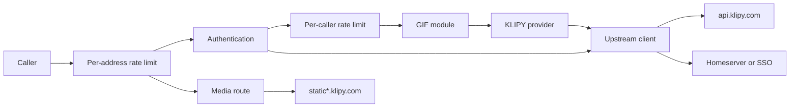
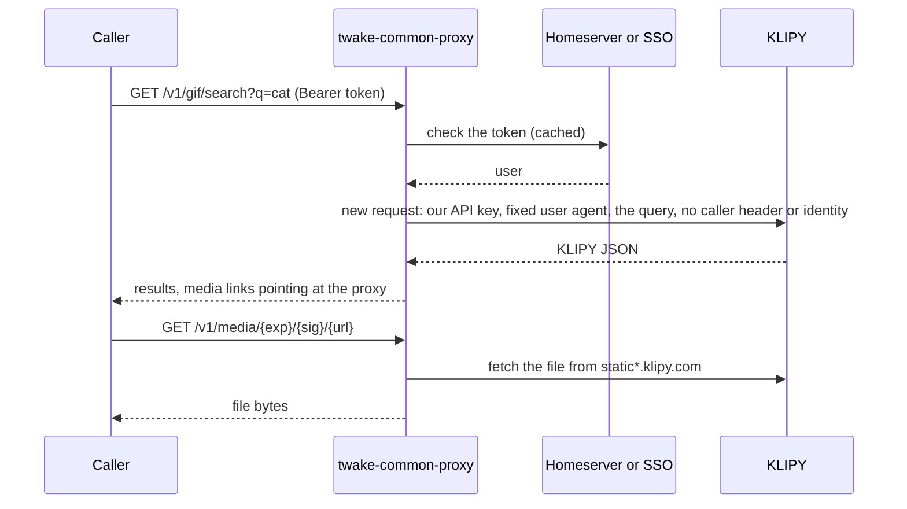
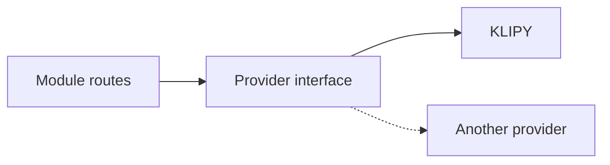

# Architecture

twake-common-proxy is one stateless Node.js process. Twake apps call it, it calls the third-party API on their behalf, and it hands the answer back with nothing about the user attached.

Terms used across these docs:

- Caller: the Twake app or backend that sends a request to the proxy.
- Provider: the third-party API a module uses, such as KLIPY for GIFs.
- Identity provider: the Matrix homeserver or OIDC SSO that vouches for a caller's token.
- Module: one feature (GIF search today), with its routes and a provider interface.

## Components



[development.md](development.md#how-the-code-is-laid-out) maps each box to its source file.

## Request pipeline

Each request goes through these steps in order. A step that refuses the request answers right away.

1. CORS. Registered at the root, so browser preflights get an answer before anything asks for a token. Only `GET` is allowed, from `cors.origins`.
2. Probes and metrics. `/healthz`, `/readyz` and `/metrics` answer here, without a token or a rate limit.
3. Per-address rate limit (`rateLimit.maxPerIp`). Runs before authentication, so guessed tokens and replayed media links count too.
4. Authentication, for `/v1` routes except media. No token, or a token nobody vouches for, gets a 401.
5. Per-caller rate limit (`rateLimit.max`), keyed by the caller identity.
6. The module handler. It validates the query with zod (400 on a bad parameter), calls the provider, and maps the answer.

Media links skip steps 4 and 5. `` and `<video>` tags cannot send a bearer token, so a signed link stands in for it.

Errors are `application/problem+json`. A provider's error body is never passed on, since it can contain the proxy's API key.

## Privacy boundary

Every outbound request is built in one of two places, the upstream client (`src/upstream.ts`, all JSON calls) or the media route (`src/media.ts`), and both build it from scratch.

- Headers are a fixed user agent and an `accept` value. No caller header, cookie or address is copied.
- The provider gets the proxy's address, its API key (in the URL path for KLIPY), and the query: search terms, locale, page and page size. No user identifier.
- The media hosts also get the caller's `Range` header, once the proxy has checked it is a plain byte range.
- The caller's token goes only to the identity provider that checks it, never to the provider.
- Redirects are refused, so a provider cannot bounce a request to another host.
- Logs and metrics record the method, the route template, the status and the duration. Fastify's own request logs are off, because the URL carries the search query.



Tests hold the proxy to this. `fakeUpstream` in `tests/helpers.ts` records every outbound request, and `tests/privacy.spec.ts` checks what leaves.

## Authentication

[api.md](api.md#authentication) describes what each kind of caller sends. Inside the proxy, the token is tried in this order:

1. A service token from `auth.services`. Compared by SHA-256 digest in constant time.
2. A JWT whose `iss` matches a configured SSO. Verified locally against the SSO's published keys. A JWT from any other issuer gets a 401 and is not tried elsewhere.
3. With an `X-Matrix-Server-Name` header, that homeserver only.
4. Otherwise, every SSO (introspection or userinfo) and, if exactly one homeserver is configured, that homeserver, all at once. The first one that accepts the token wins. With several homeservers, a Matrix client must send the header.

If no check accepts the token and at least one identity provider could not be reached, the answer is 503 instead of 401. A 4xx from an identity provider means the token is bad. Anything else means the proxy cannot tell.

Each SSO's discovery document is fetched once and kept. Its keys are fetched on the first JWT, and fetched again when a token is signed with an unknown key, at most once a minute.

Tokens accepted by a homeserver, introspection or userinfo are cached by hash, for `tokenCacheSeconds` or until the token expires if introspection says so. There are two caches, one for homeservers and one shared by all SSOs, each holding up to 10,000 tokens with the oldest dropped first. JWTs are not cached, since checking one makes no call.

## Media links

When `proxyMedia` is on, the module replaces every media URL in a result with a signed link to the proxy:

```
/v1/media/{exp}/{sig}/{base64url of the provider URL}
```

- `sig` is an HMAC-SHA256 over the expiry and the provider URL, keyed with `media.signingKey`.
- Time is cut into `urlTtlSeconds` windows, and `exp` is the end of the window after the current one. One file keeps the same link for a whole window, so the browser cache works across searches, and a link lives between one and two TTLs.

To serve a link, the proxy checks the expiry and the signature, then that the URL is `https` on one of the provider's media hosts. It fetches the file with the provider timeout on the response headers and 60 seconds for the body. It relays only images and videos, up to `media.maxBytes`, and checks that limit both on `content-length` and while streaming. The response is privately cacheable until the link expires, sandboxed by CSP, and sent with `no-referrer`.

When `proxyMedia` is off, clients get the provider's own URLs and the provider sees their addresses.

## Modules and providers



A module owns its routes, its query validation, and a result type that does not depend on the provider. A provider maps one third-party API onto that interface and lists the hosts its media comes from. The module drops any media that is not `https` on those hosts before it signs links.

Provider answers are parsed with zod. If a provider changes its format, callers get a 502.

`GET /v1/modules` lists the modules that are on, with their provider and the attribution the UI must show. [development.md](development.md) explains how to add a provider or a module.

## State

The proxy writes nothing to disk and shares nothing between pods. Rate limit counters, token caches, and each SSO's discovery document and keys live in the process memory, and a restart clears them. [deploy.md](deploy.md#scaling) covers what this means with several replicas.

## Observability

- Logs are JSON lines from pino, one per request, with `method`, `route`, `status` and `ms`. A provider error status adds a `provider error` line with `upstreamStatus`.
- `/metrics` serves Prometheus metrics: `tcp_http_requests_total` by method, route and status, `tcp_http_request_duration_seconds` by route, and Node's default process metrics.
