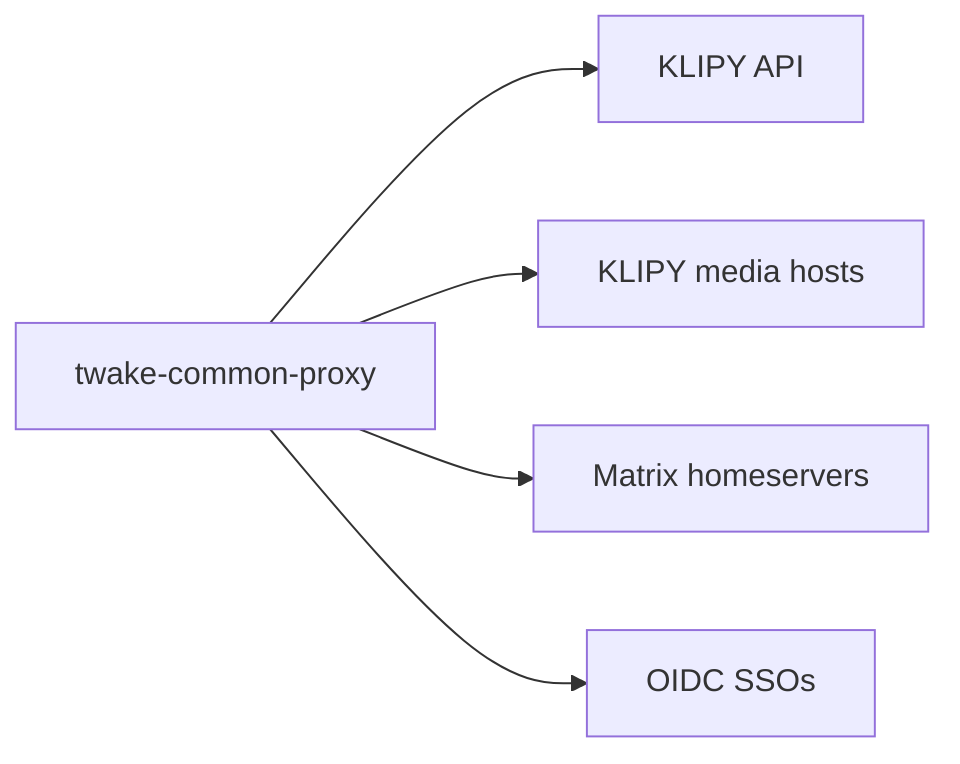

# Dependencies

## External services

The proxy needs outbound HTTPS to these, and nothing else:

- KLIPY API, `api.klipy.com`, for GIF search, trending, categories and autocomplete.
- KLIPY media hosts, `static.klipy.com`, `static1.klipy.com` and `static2.klipy.com`, when `proxyMedia` is on.
- Each homeserver's federation API (`federationUrl`, default `https://<serverName>`), for `/_matrix/federation/v1/openid/userinfo`.
- Each SSO's discovery document, its keys (`jwks_uri`), and its introspection or userinfo endpoint.

When one of them fails:

- On API calls, KLIPY errors give a 502, timeouts a 504, and a spent quota (KLIPY's 429) a 503.
- On media downloads, any failure from the media hosts gives a 502.
- An unreachable identity provider gives a 503 for tokens it has to check. Cached tokens and JWTs signed with keys the proxy already holds keep working.

Production needs KLIPY's written approval, see the [README](../README.md#release-it).

## Runtime libraries

- `fastify`: HTTP server, routing and request hooks.
- `@fastify/cors`: CORS headers and preflights.
- `@fastify/rate-limit`: per-address and per-caller limits, counted in memory.
- `jose`: JWT verification against an SSO's published keys.
- `zod`: validates the config, the query parameters, and every answer from a provider or identity provider.
- `yaml`: reads the config file.
- `pino`: JSON logs.
- `prom-client`: Prometheus metrics.

Outbound HTTP uses Node's built-in `fetch`, and signing and hashing use `node:crypto`.

## Development tools

- `typescript` compiles `src/` to `dist/`. `tsx` runs it in watch mode for `npm run dev`.
- `vitest` runs the tests.
- `eslint` with `typescript-eslint`, and `prettier`, check the code style.

## Platform

- Node.js 22 or later.
- The image builds on `node:22-bookworm-slim` and runs on `gcr.io/distroless/nodejs22-debian12:nonroot`, as a non-root user, with only production dependencies. It listens on 8080 and reads its config from `/etc/twake-common-proxy/config.yaml`.

## Build and release

- Every pull request and push to `main` runs `npm run check`, the TypeScript build, and a Docker build in GitHub Actions.
- A `vX.Y.Z` tag runs the checks again, pushes the image to GHCR, and creates a GitHub release with generated notes. The [README](../README.md#release-it) has the steps.
