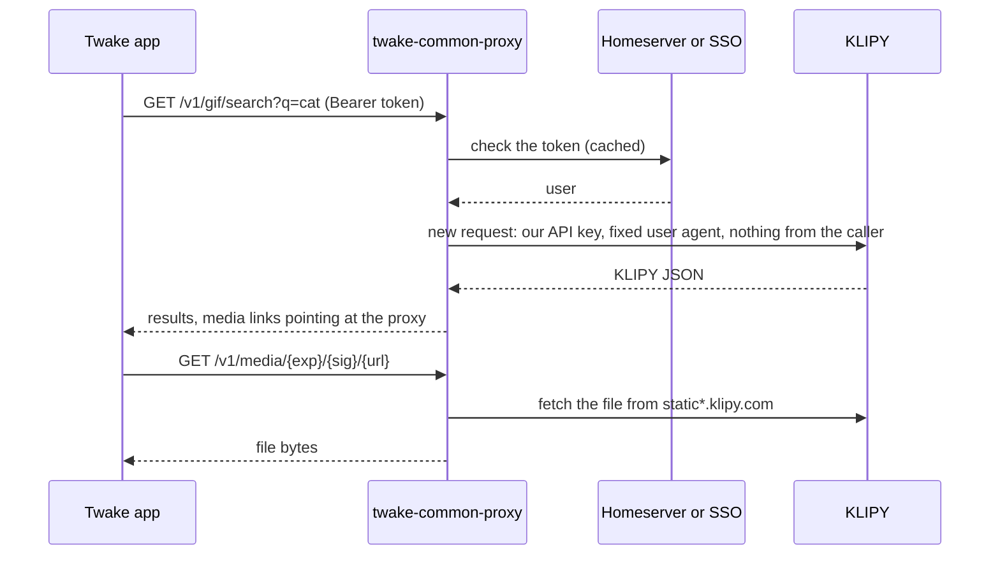

# Deploying twake-common-proxy

## What the proxy guarantees

- Each upstream request is built from scratch. Caller headers, cookies and addresses are never copied.
- No user identifier is sent to the provider. It sees the proxy, its API key and the search terms.
- Logs and metrics record the route, status and duration, never the query, the caller or their address.
- Media links are signed and expire. The proxy only fetches media from the provider's own hosts and only relays images and videos.

## Configuration

The service reads a YAML file (`CONFIG_FILE`, default `config.yaml`). Any value can reference the environment as `${NAME}` or `${NAME:-default}`, which is how secrets get in. [config.example.yaml](../config.example.yaml) lists every setting.

- `server.publicUrl`: the URL browsers reach the proxy at. Media links are built from it.
- `server.trustProxy`: the reverse proxies whose `X-Forwarded-For` is trusted. Without it, every client behind the ingress shares one per-address rate limit.
- `cors.origins`: web apps allowed to call the proxy from the browser.
- `auth.matrix.homeservers`: one entry per homeserver whose users may call the proxy. `federationUrl` defaults to `https://<serverName>`.
- `auth.oidc.providers`: one entry per SSO. `issuer` must equal the tokens' `iss` claim. `audiences` limits tokens to those client ids, which needs JWTs or `introspection` credentials, since userinfo cannot tell.
- `auth.services`: backends and their static tokens, 32+ characters.
- `media.signingKey`: 32+ characters. Rotating it breaks the links already handed out.
- `modules.<module>`: `enabled`, the `provider` and its entry under `providers` with its API key. `proxyMedia: false` hands clients the provider's own media URLs, which exposes user IPs to the provider.

## Shutdown

On SIGTERM, `/readyz` fails for `server.shutdownDelaySeconds` so the load balancer stops sending traffic, then the server finishes in-flight requests and exits.

## What it reaches

- The provider's API and media hosts (`api.klipy.com`, `static*.klipy.com`).
- Each homeserver's federation API, for `/_matrix/federation/v1/openid/userinfo`.
- Each SSO's discovery document, keys, and introspection or userinfo endpoint.

## Scaling

The service keeps no state. Rate limits and the token cache are per pod, so with N replicas a caller gets up to N times `rateLimit.max`.
